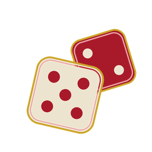

# All In



A card-combat roguelike set in a casino. Twenty-five years ago Lucky Jack bet
everything at the Big Shots Table, lost it, and then bet his son; tonight he
walks back in to collect. Every encounter is a duel against the House. You draw
seven cards, play up to five, and the cards you play build up The Hand. Clear
the enemy's House Edge and the excess comes off their chips — fall short and
the shortfall comes off yours. Two **Tells** bend that: **Streak** doubles a
card's Stack if the card before it had any Tell, and **All In** burns another
card from your Draw and takes its Stack. So the order you play in is the skill.
Then there is The House itself, which reads your Hand after your fourth card and
sets its Edge just above it, leaving your fifth card — the Hole Card — as the
only one it cannot see.

## Running it

```sh
cargo run --release
```

That is the whole thing. There is no launcher, no config file, and no save: a
run lives and dies in one sitting.

**Run it from the repo root.** Art is found two ways — Bevy's asset server, and
an `.exists()` check on `assets/…` that decides whether to load a file or fall
back to a text label (see `assets/README.md`). That second check is relative to
the working directory, so launching from anywhere else gives you a game that
runs with every image silently missing. If you want to hand someone the binary
out of `target/release/`, copy `assets/` next to it and launch from there.

The toolchain is pinned at **Rust 1.97.1** (`rust-toolchain.toml`, and
`flake.lock` for the Nix devshell, which is where the version actually lands —
`flake.nix` just names a bare `rustc`. CI checks the two agree). On NixOS or with
Nix installed:

```sh
nix develop          # or: direnv allow
cargo run --release
```

Without Nix you need the system libraries winit and wgpu dlopen at runtime —
Wayland or X11, `libxkbcommon`, a Vulkan loader — plus `alsa-lib` and `udev` to
build. The devshell exists so you do not have to chase that list.

### A stale `target/` after a pull

If a pull lands and the build then fails to *link* — not to compile — the
culprit is a stale artifact for this crate, not your machine. It bit us mid
playtest. The fix:

```sh
cargo clean -p all-in --release   # --release is not optional; see below
cargo run --release
```

**`--release` is load-bearing.** `cargo clean -p all-in` on its own cleans the
dev profile only; against a release build it reports `Removed 0 files` and
changes nothing, so it looks like the advice failed when it was never applied.
Drop the flag when the stale build is a debug one.

Either way you drop only this crate's artifacts and every dependency stays
compiled, so the rebuild is **~11s**, not the full build below. Reach for a
bare `cargo clean` only if that does not do it — it costs you the whole six
minutes.

### Build times

Measured on the pinned toolchain, 8 cores, nothing cached:

| | |
| --- | --- |
| `cargo build --release`, from scratch | **6m 21s** |
| Rebuild after touching this crate's source | **~11s** |

The six minutes is Bevy compiling, once. After that every edit to `src/` is the
eleven seconds, so `cargo run --release` is a perfectly reasonable loop to work
in — and `cargo run` (debug) is faster still, because the dev profile already
builds dependencies at `opt-level = 3` and the game runs at a playable speed
either way.

**Build it before the judges arrive.** Have the game open at the Lobby when they
sit down; see `docs/pitch.md` for the demo script.

## Controls

Keyboard throughout. Number keys work on the top row or the numpad.

| Key | Where | What it does |
| --- | --- | --- |
| **Space** | Title | Starts. The marquee answers to nothing else, on purpose. |
| **any key** | Prose screens | Dismisses — the Opening, the Info Room, floor intros, the result of a fight, the endings. |
| **1**–**3** | Lobby and menus | Takes the numbered option. |
| **Enter** | Lobby | Walks the Floor — the same as **3**. |
| **Enter** | Fight or Fold | Sits down. The same as **1**, Fight. |
| **1**–**7**, or **click** | Combat | Plays that card out of your Draw. Clicking a card is the same as pressing its number. |
| **Enter** | Combat | Shows your Hand and ends the turn. |
| **P** / **H** | Push Your Luck | **P**ush the coin flip, or **H**old and take the Payout you have. |
| **I** | Combat, Fight or Fold | The glossary: what every word on screen means. |
| **Esc** | Glossary | Closes it. |
| **Esc** | Combat | Backs out of an All In before you have named the card to burn. |
| **Esc** | The Arcade | Leaves the tutorial for the Lobby. |

Two screens deliberately do *not* take Enter. The Title answers only to Space,
so a stray keypress on the way to the table cannot skip the game's own name. And
a Perk choice takes only **1** or **2**, because Enter advances every other
screen in the shell and a Perk is picked once and never given back.

There is no Esc-to-quit in a fight. Once you sit down, the only ways off the
table are winning and losing — which is the point.

The Lobby offers three doors: **1** the Info Room (the rules in prose), **2** the
Arcade (a scripted practice duel that fires every mechanic once — this is the
demo), and **3** the Floor, where the run starts.

## Layout

| Path | What it is |
| --- | --- |
| `src/run.rs` | Cards, run state, enemies. The combat ↔ overworld seam. |
| `src/combat/` | The duel: rules, UI, the glossary. |
| `src/overworld/` | The shell: title, lobby, floors, rewards, endings. |
| `CONTEXT.md` | The game's vocabulary. Read this before naming anything. |
| `docs/adr/` | Architectural decisions. |
| `docs/pitch.md` | The 60-second pitch and the demo script. |
| `assets/README.md` | The art contract — paths are bound in code. |

## Developing

```sh
cargo test           # the whole suite
cargo run            # debug build, with the dev flags below
cargo run -- --help  # what they are
```

Debug builds carry a dev entry point (`src/devstart.rs`) that starts a run
partway up the casino with a pinned seed and a pocket already full, so one
encounter can be played on its own:

```sh
cargo run -- --encounter pit-boss --seed 42 --with sixplays,dice
```

Release builds do not compile that module, so a shipped binary has no flags to
find.

## Window icon

`assets/icon.png` is the game's icon, and it is *not* the window icon. Bevy
0.19 has no window-icon API — `bevy_window` carries only cursor icons, and
`bevy_winit` re-exports `EventLoopProxy` and the cursor types but not
`winit::window::Icon`. Setting one means taking a direct dependency on `winit`
pinned to whatever Bevy uses (0.30.13 today), and `set_window_icon` does nothing
on macOS anyway, where the Dock and title bar read an app bundle rather than the
running process. Not worth a version-locked dependency for no effect on the
machine we demo from. On Windows and Linux it would work, if someone wants it
later.
