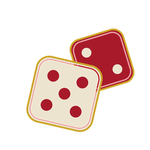

# All In



A card-combat roguelike set in a casino. Twenty-five years ago Lucky Jack bet
everything at the Big Shots Table, lost it, and then bet his son; tonight he
walks back in to collect.

Every encounter is a duel against the House, and the House deals first. It lays
down a row of **Opposing Cards** — the first face up, the rest a coin toss — and
you cover them slot for slot out of a Draw of seven. Confirm, both rows turn
over, and the side that comes up short loses the difference off its
chips. You are always playing against a number you can only half see.

Which card faces which is the whole game, because every **Tell** reads the
table by position: **Streak** doubles if the card in the slot to its left has a
Tell, **Copycat** takes the print of the slot to its right, **Flop** takes the
print of the Opposing Card straight across, and **All In** burns a card from
your Draw for its chips. Nothing resolves until you confirm, so you can put a
card down, pull it back out, and re-order the row until it reads the way you
want. Then there is The House itself, which keeps its own last card blank until
you have committed and fills it in on everything but your last card — leaving
that one, the **Hole Card**, as the only card it cannot see.

## Playing it

Linux and Windows builds are on itch.io: **https://voraciousjp.itch.io/all-in**.
Unzip, then run `all-in.sh` on Linux or double-click `all-in.exe` on Windows. On Windows,
SmartScreen may warn that the app is unrecognised (it isn't signed): choose
**More info → Run anyway**.

## Running it

```sh
cargo run --release
```

That is the whole thing. There is no launcher, no config file, and no save: a
run lives and dies in one sitting.

**Run it from the repo root.** Art is found two ways — Bevy's asset server, and
an `.exists()` check on `assets/…` that decides whether to load a file or fall
back to a text label (see `assets/README.md`). That second check is relative to
the working directory, so launching from anywhere else gives you a game that
runs with every image silently missing. If you want to hand someone the binary
out of `target/release/`, copy `assets/` next to it and launch from there.

The toolchain is pinned at **Rust 1.97.1** (`rust-toolchain.toml`, and
`flake.lock` for the Nix devshell, which is where the version actually lands —
`flake.nix` just names a bare `rustc`. CI checks the two agree). On NixOS or with
Nix installed:

```sh
nix develop          # or: direnv allow
cargo run --release
```

Without Nix you need the system libraries winit and wgpu dlopen at runtime —
Wayland or X11, `libxkbcommon`, a Vulkan loader — plus `alsa-lib` and `udev` to
build. The devshell exists so you do not have to chase that list.

### On Windows

Build it natively; there is no cross-compile from Linux yet.

1. Install the **Visual Studio Build Tools** with the *Desktop development with
   C++* workload. Rust's default Windows toolchain links with Microsoft's
   linker.
2. Install Rust with [rustup](https://rustup.rs). From the repo, rustup reads
   `rust-toolchain.toml` and fetches the pinned 1.97.1 on the first build.
3. From the repo root:

   ```powershell
   cargo run --release
   ```

Nothing else is needed: no Nix, and none of the Linux system libraries above.
The same rule applies, though: **run it from the repo root**, or every image
goes missing.

The game window opens **with no console** (`#![windows_subsystem = "windows"]`
in `src/main.rs`), even when you launch it from a terminal. So a crash
closes the window without printing anything. To see the panic, comment that
line out locally and run again. Don't commit that change.

The easy way to get a Windows zip is not to build one yourself: on GitHub, open
**Actions → windows-build → Run workflow**. It builds and packages on a Windows
machine and attaches `all-in-windows.zip` to the run (download it, then unzip
once).

To package a zip yourself, run this from Git Bash. Git for Windows
provides `bash`; the script also needs Python 3 on the `PATH` (check that
`python3 --version` works):

```sh
tools/package.sh windows target/release/all-in.exe
```

That writes `dist/all-in-windows.zip`. Players unzip it and double-click
`all-in.exe`: Explorer starts it in its own folder, so it finds `assets/`.

### A stale `target/` after a pull

If a pull lands and the build then fails to *link* — not to compile — the
culprit is a stale artifact for this crate, not your machine. It bit us mid
playtest. The fix:

```sh
cargo clean -p all-in --release   # --release is not optional; see below
cargo run --release
```

**`--release` is load-bearing.** `cargo clean -p all-in` on its own cleans the
dev profile only; against a release build it reports `Removed 0 files` and
changes nothing, so it looks like the advice failed when it was never applied.
Drop the flag when the stale build is a debug one.

Either way you drop only this crate's artifacts and every dependency stays
compiled, so the rebuild is **~11s**, not the full build below. Reach for a
bare `cargo clean` only if that does not do it — it costs you the whole six
minutes.

### Build times

Measured on the pinned toolchain, 8 cores, nothing cached:

| | |
| --- | --- |
| `cargo build --release`, from scratch | **6m 21s** |
| Rebuild after touching this crate's source | **~11s** |

The six minutes is Bevy compiling, once. After that every edit to `src/` is the
eleven seconds, so `cargo run --release` is a perfectly reasonable loop to work
in — and `cargo run` (debug) is faster still, because the dev profile already
builds dependencies at `opt-level = 3` and the game runs at a playable speed
either way.

**Build it before the judges arrive.** Have the game open at the Lobby when they
sit down; see `docs/pitch.md` for the demo script.

## Controls

Keyboard throughout. Number keys work on the top row or the numpad.

| Key | Where | What it does |
| --- | --- | --- |
| **Space** | Title | Starts. The marquee answers to nothing else, on purpose. |
| **any key** | Prose screens | Dismisses — the Opening, the Info Room, floor intros, the result of a fight, the endings. |
| **1**–**3** | Lobby and menus | Takes the numbered option. |
| **Enter** | Lobby | Walks the Floor — the same as **3**. |
| **Enter** | Fight or Fold | Sits down. The same as **1**, Fight. |
| **1**–**7**, or **click** | Combat | Puts that card from your Draw into the next empty slot of your row. Clicking a card is the same as pressing its number. |
| **click** | Combat, your row | Takes that card back out. Everything to its right slides left, so the Tells re-read their neighbours. |
| **Backspace** | Combat | The same, for the last card you placed. |
| **Enter** | Combat | Confirms the row. Both sides turn over and The Hand meets the House Edge. |
| **P** / **H** | Push Your Luck | **P**ush the coin flip, or **H**old and take the Payout you have. |
| **I** | Combat, Fight or Fold | The glossary: what every word on screen means. |
| **Esc** | Glossary | Closes it. |
| **Esc** | Combat | Backs out of an All In before you have named the card to burn. |
| **Esc** | The Arcade | Leaves the tutorial for the Lobby. |

Two screens deliberately do *not* take Enter. The Title answers only to Space,
so a stray keypress on the way to the table cannot skip the game's own name. And
a Perk choice takes only **1** or **2**, because Enter advances every other
screen in the shell and a Perk is picked once and never given back.

There is no Esc-to-quit in a fight. Once you sit down, the only ways off the
table are winning and losing — which is the point.

The Lobby offers three doors: **1** the Info Room (the rules in prose), **2** the
Arcade (a scripted practice duel that fires every mechanic once — this is the
demo), and **3** the Floor, where the run starts.

## Layout

| Path | What it is |
| --- | --- |
| `src/run.rs` | Cards, run state, enemies. The combat ↔ overworld seam. |
| `src/combat/` | The duel: rules, UI, the glossary. |
| `src/overworld/` | The shell: title, lobby, floors, rewards, endings. |
| `tools/sim/` | The balance sim: whole runs against the real duel, headless. |
| `CONTEXT.md` | The game's vocabulary. Read this before naming anything. |
| `docs/onboarding.md` | New to the team? Start here: what to read, how tickets are claimed. |
| `docs/adr/` | Architectural decisions. |
| `docs/pitch.md` | The 60-second pitch and the demo script. |
| `assets/README.md` | The art contract — paths are bound in code. |

## Developing

```sh
cargo test           # the whole suite
cargo run            # debug build, with the dev flags below
cargo run -- --help  # what they are
cargo run --release -p sim   # the balance sim; see tools/sim/README.md
```

Debug builds carry a dev entry point (`src/devstart.rs`) that starts a run
partway up the casino with a pinned seed and a pocket already full, so one
encounter can be played on its own:

```sh
cargo run -- --encounter pit-boss --seed 42 --with sixplays,dice
```

Release builds do not compile that module, so a shipped binary has no flags to
find.

## Window icon

`assets/icon.png` is the game's icon, and it is *not* the window icon. Bevy
0.19 has no window-icon API — `bevy_window` carries only cursor icons, and
`bevy_winit` re-exports `EventLoopProxy` and the cursor types but not
`winit::window::Icon`. Setting one means taking a direct dependency on `winit`
pinned to whatever Bevy uses (0.30.13 today), and `set_window_icon` does nothing
on macOS anyway, where the Dock and title bar read an app bundle rather than the
running process. Not worth a version-locked dependency for no effect on the
machine we demo from. On Windows and Linux it would work, if someone wants it
later.
